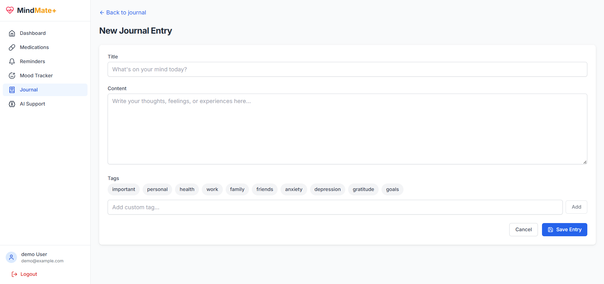

# MindMate: Mental Health Support Application

## Table of Contents
- [1. Introduction](#1-introduction)
  - [1.1 Purpose](#11-purpose)
  - [1.2 Key Features](#12-key-features)
  - [1.3 Tech Stack](#13-tech-stack)
- [2. Architecture Overview](#2-architecture-overview)
  - [2.1 System Architecture](#21-system-architecture)
  - [2.2 Component Diagram](#22-component-diagram)
  - [2.3 Data Flow](#23-data-flow)
- [3. Backend Implementation](#3-backend-implementation)
  - [3.1 FastAPI Setup](#31-fastapi-setup)
  - [3.2 Database (DynamoDB)](#32-database-dynamodb)
  - [3.3 Authentication System](#33-authentication-system)
  - [3.4 API Endpoints](#34-api-endpoints)
  - [3.5 Services Layer](#35-services-layer)
- [4. Frontend Implementation](#4-frontend-implementation)
  - [4.1 User Interface Screenshots](#41-user-interface-screenshots)
  - [4.2 React/TypeScript Setup](#42-reacttypescript-setup)
  - [4.3 State Management](#43-state-management)
  - [4.4 Routing](#44-routing)
  - [4.5 Key Components](#45-key-components)
  - [4.6 API Integration](#46-api-integration)
- [5. AI/LLM Implementation](#5-aillm-implementation)
  - [5.1 NLP Service](#51-nlp-service)
  - [5.2 RAG Pipeline](#52-rag-pipeline)
  - [5.3 LLM Integration](#53-llm-integration)
  - [5.4 Context-Aware Personalization](#54-context-aware-personalization)
- [6. User Workflows](#6-user-workflows)
  - [6.1 Authentication Flow](#61-authentication-flow)
  - [6.2 Medication Management Flow](#62-medication-management-flow)
  - [6.3 Mood Tracking Flow](#63-mood-tracking-flow)
  - [6.4 AI Chat Flow](#64-ai-chat-flow)
- [7. Complexity Assessment](#7-complexity-assessment)
  - [7.1 Backend Complexity](#71-backend-complexity)
  - [7.2 Frontend Complexity](#72-frontend-complexity)
  - [7.3 AI/LLM Complexity](#73-aillm-complexity)
- [8. AI/LLM Tools and Techniques](#8-aillm-tools-and-techniques)
  - [8.1 Google Gemini Pro](#81-google-gemini-pro)
  - [8.2 LangChain](#82-langchain)
  - [8.3 FAISS Vector Database](#83-faiss-vector-database)
  - [8.4 NLTK](#84-nltk)
  - [8.5 RAG Architecture](#85-rag-architecture)
- [9. Project Overview Questions](#9-project-overview-questions)
  - [9.1 What specific mental health problem is the MindMate application trying to solve?](#91-what-specific-mental-health-problem-is-the-mindmate-application-trying-to-solve)
  - [9.2 Who is the target audience for this mental health application?](#92-who-is-the-target-audience-for-this-mental-health-application)
  - [9.3 What are the key features and functionalities that make this application effective for mental health support?](#93-what-are-the-key-features-and-functionalities-that-make-this-application-effective-for-mental-health-support)
  - [9.4 What measurable success criteria have been established for this project?](#94-what-measurable-success-criteria-have-been-established-for-this-project)
  - [9.5 What are the potential risks and challenges in implementing and maintaining this mental health application?](#95-what-are-the-potential-risks-and-challenges-in-implementing-and-maintaining-this-mental-health-application)
  - [9.6 What external dependencies (APIs, services, libraries) does this application rely on?](#96-what-external-dependencies-apis-services-libraries-does-this-application-rely-on)
  - [9.7 What specific security and privacy requirements are implemented to protect sensitive mental health data?](#97-what-specific-security-and-privacy-requirements-are-implemented-to-protect-sensitive-mental-health-data)

## 1. Introduction

### 1.1 Purpose
MindMate is a comprehensive mental health support application with medicine reminder functionality. It helps users manage their mental health journey through several integrated features, providing a holistic approach to mental wellness.

### 1.2 Key Features
- **User Authentication**: Secure user registration and login
- **Medication Management**: Track medications, dosages, and schedules
- **Reminder System**: Get notified when it's time to take medications
- **Mood Tracking**: Monitor mood patterns over time with ratings and tags
- **Journal**: Record thoughts and feelings with searchable entries
- **AI-powered Support**: Get personalized coping strategies and mental health support

### 1.3 Tech Stack

#### Backend
- **Framework**: FastAPI (Python)
- **Database**: AWS DynamoDB
- **Storage**: AWS S3
- **AI/ML**:
  - Google Gemini Pro for LLM capabilities
  - LangChain for RAG pipeline and orchestration
  - FAISS for vector storage and similarity search
  - NLTK for natural language processing

#### Frontend
- **Framework**: React 18 with Vite
- **Language**: TypeScript
- **Styling**: Tailwind CSS
- **State Management**: Zustand
- **Form Handling**: React Hook Form
- **HTTP Client**: Axios
- **Routing**: React Router v6
- **Data Visualization**: Chart.js with react-chartjs-2

## 2. Architecture Overview

### 2.1 System Architecture
MindMate follows a client-server architecture with RESTful API communication:

1. **Client (Frontend)**: React SPA that provides the user interface
2. **Server (Backend)**: FastAPI application that handles business logic and data access
3. **Database**: AWS DynamoDB for data persistence
4. **AI Services**: Integrated LLM and NLP capabilities

### 2.2 Component Diagram
```
┌─────────────────┐     ┌─────────────────────────────────────┐
│                 │     │                                     │
│    Frontend     │     │               Backend               │
│  (React/TypeScript)   │              (FastAPI)              │
│                 │     │                                     │
└────────┬────────┘     └───────────────────┬─────────────────┘
         │                                  │
         │ HTTP/REST                        │
         │                                  │
         ▼                                  ▼
┌─────────────────┐     ┌─────────────────────────────────────┐
│                 │     │                                     │
│  Authentication │     │             DynamoDB                │
│    (JWT)        │     │                                     │
│                 │     │                                     │
└─────────────────┘     └───────────────────┬─────────────────┘
                                            │
                                            │
                        ┌───────────────────┴─────────────────┐
                        │                                     │
                        │           AI Services               │
                        │     (Gemini Pro, LangChain)         │
                        │                                     │
                        └─────────────────────────────────────┘
```

### 2.3 Data Flow
1. User interacts with the React frontend
2. Frontend makes API calls to the FastAPI backend
3. Backend authenticates requests using JWT
4. Backend processes requests, interacting with DynamoDB and AI services as needed
5. Backend returns responses to the frontend
6. Frontend updates the UI based on the responses

## 3. Backend Implementation

### 3.1 FastAPI Setup
The backend is built with FastAPI, a modern Python web framework. The main application is defined in `backend/main.py`:

```python
app = FastAPI(
    title=settings.APP_NAME,
    version=settings.APP_VERSION,
    description="Mental Health Support Application with Medicine Reminder Functionality",
    docs_url="/api/docs",
    redoc_url="/api/redoc",
    openapi_url="/api/openapi.json",
)

# Add CORS middleware
app.add_middleware(
    CORSMiddleware,
    allow_origins=["*"],  # For development, restrict in production
    allow_credentials=True,
    allow_methods=["*"],
    allow_headers=["*"],
)

# Include routers
app.include_router(auth.router, prefix="/api/auth", tags=["Authentication"])
app.include_router(medications.router, prefix="/api/medications", tags=["Medications"])
app.include_router(reminders.router, prefix="/api/reminders", tags=["Reminders"])
app.include_router(moods.router, prefix="/api/moods", tags=["Mood Tracking"])
app.include_router(journal.router, prefix="/api/journal", tags=["Journal"])
app.include_router(ai.router, prefix="/api/ai", tags=["AI Support"])
```

### 3.2 Database (DynamoDB)
The application uses AWS DynamoDB for data storage. The database utilities are defined in `backend/db/dynamodb.py`:

```python
# Table references
users_table = dynamodb.Table("Users")
medications_table = dynamodb.Table("Medications")
reminders_table = dynamodb.Table("Reminders")
mood_entries_table = dynamodb.Table("MoodEntries")
journal_entries_table = dynamodb.Table("JournalEntries")
assessments_table = dynamodb.Table("Assessments")
resources_table = dynamodb.Table("Resources")
feedback_table = dynamodb.Table("Feedback")
chat_history_table = dynamodb.Table("ChatHistory")
```

The database module provides generic CRUD operations for all tables, making it easy to interact with DynamoDB:

```python
async def create_item(table, item_data: Dict[str, Any], pk_name: str, sk_name: Optional[str] = None) -> Dict[str, Any]:
    """Create a new item in a table."""
    item_id = generate_uuid()
    timestamp = get_current_timestamp()

    item = {
        pk_name: item_id,
        "created_at": timestamp,
        "updated_at": timestamp,
        **item_data
    }

    if sk_name and sk_name in item_data:
        item[sk_name] = item_data[sk_name]

    table.put_item(Item=item)
    return item
```

### 3.3 Authentication System

The authentication system uses JWT tokens for secure user authentication. The security utilities are defined in `backend/core/security.py`:

```python
# Password hashing context
pwd_context = CryptContext(schemes=["bcrypt"], deprecated="auto")

def verify_password(plain_password: str, hashed_password: str) -> bool:
    """Verify a password against a hash."""
    return pwd_context.verify(plain_password, hashed_password)

def get_password_hash(password: str) -> str:
    """Generate a password hash."""
    return pwd_context.hash(password)

def create_access_token(data: Dict[str, Any], expires_delta: Optional[timedelta] = None) -> str:
    """Create a JWT access token."""
    to_encode = data.copy()
    if expires_delta:
        expire = datetime.utcnow() + expires_delta
    else:
        expire = datetime.utcnow() + timedelta(minutes=settings.ACCESS_TOKEN_EXPIRE_MINUTES)
    to_encode.update({"exp": expire})
    encoded_jwt = jwt.encode(to_encode, settings.SECRET_KEY, algorithm=settings.ALGORITHM)
    return encoded_jwt
```

The authentication service handles user registration, login, and token creation:

```python
async def authenticate_user(email: str, password: str) -> Dict[str, Any]:
    """Authenticate a user."""
    user = await get_user_by_email(email)
    if not user:
        raise AuthException("Invalid email or password")

    if not verify_password(password, user["password_hash"]):
        raise AuthException("Invalid email or password")

    # Remove password_hash from response
    user.pop("password_hash", None)

    return user

async def create_user_token(user_id: str) -> str:
    """Create a JWT token for a user."""
    expires_delta = timedelta(minutes=settings.ACCESS_TOKEN_EXPIRE_MINUTES)
    return create_access_token(
        data={"sub": user_id},
        expires_delta=expires_delta
    )
```

### 3.4 API Endpoints

The API endpoints are organized by feature, with each feature having its own router. For example, the authentication endpoints are defined in `backend/api/auth.py`:

```python
@router.post("/register", response_model=UserResponse, status_code=status.HTTP_201_CREATED)
async def register(user_data: UserCreate):
    """Register a new user."""
    try:
        user = await auth_service.register_user(user_data.model_dump())
        return user
    except AuthException as e:
        raise HTTPException(status_code=status.HTTP_400_BAD_REQUEST, detail=str(e))

@router.post("/login", response_model=Token)
async def login(user_data: UserLogin):
    """Login a user."""
    try:
        user = await auth_service.authenticate_user(user_data.email, user_data.password)
        access_token = await auth_service.create_user_token(user["user_id"])
        return {"access_token": access_token, "token_type": "bearer"}
    except AuthException as e:
        raise HTTPException(status_code=status.HTTP_401_UNAUTHORIZED, detail=str(e))
```

The mood tracking endpoints are defined in `backend/api/moods.py`:

```python
@router.post("", response_model=MoodResponse, status_code=status.HTTP_201_CREATED)
async def create_mood_entry(
    mood_data: MoodCreate,
    current_user: dict = Depends(get_current_user)
):
    """Create a new mood entry."""
    mood_entry = await mood_service.create_mood_entry(
        current_user["user_id"],
        mood_data.model_dump()
    )
    return mood_entry

@router.get("/stats", response_model=MoodStats)
async def get_mood_statistics(
    days: int = Query(30, ge=1, le=365),
    current_user: dict = Depends(get_current_user)
):
    """Get mood statistics for the current user."""
    stats = await mood_service.get_mood_statistics(current_user["user_id"], days)
    return stats
```

### 3.5 Services Layer

The services layer handles business logic and interacts with the database layer. Each feature has its own service module. For example, the mood service is defined in `backend/services/mood_service.py`:

```python
async def create_mood_entry(user_id: str, mood_data: Dict[str, Any]) -> Dict[str, Any]:
    """Create a new mood entry."""
    # Set timestamp to current time if not provided
    if not mood_data.get("timestamp"):
        mood_data["timestamp"] = datetime.utcnow().isoformat()

    mood_data["user_id"] = user_id
    mood_entry = await create_item(mood_entries_table, mood_data, "entry_id", "user_id")
    return mood_entry

async def get_mood_statistics(user_id: str, days: int = 30) -> Dict[str, Any]:
    """Get mood statistics for a user."""
    # Get mood entries for the specified period
    end_date = datetime.utcnow()
    start_date = end_date - timedelta(days=days)

    mood_entries = await list_mood_entries(
        user_id,
        limit=1000,
        start_date=start_date.isoformat(),
        end_date=end_date.isoformat()
    )

    # Calculate statistics
    # ...
```

## 4. Frontend Implementation

### 4.1 User Interface Screenshots

#### Login Page


#### Dashboard


#### Medications Tab


#### Add Medication


#### Reminders Tab


#### Add Reminder


#### Mood Tab


#### Mood Statistics


#### Journal Tab


#### Add Journal Entry


#### AI Support Tab


### 4.2 React/TypeScript Setup

The frontend is built with React and TypeScript, using Vite as the build tool. The main entry point is defined in `frontend/src/main.tsx`:

```typescript
import { StrictMode } from 'react';
import { createRoot } from 'react-dom/client';
import { BrowserRouter } from 'react-router-dom';
import App from './App';
import './index.css';

createRoot(document.getElementById('root')!).render(
  <StrictMode>
    <BrowserRouter>
      <App />
    </BrowserRouter>
  </StrictMode>
);
```

### 4.3 State Management

The application uses Zustand for state management. For example, the authentication state is managed by the `authStore`:

```typescript
export const useAuthStore = create<AuthState>((set, get) => ({
  user: null,
  isAuthenticated: false,
  isLoading: false,
  error: null,
  token: null,

  login: async (email, password) => {
    set({ isLoading: true, error: null });
    try {
      const response = await authService.login(email, password);
      const { access_token } = response;

      // Store token in localStorage
      localStorage.setItem('token', access_token);

      // Get user info
      const userInfo = await authService.getCurrentUser();

      set({
        isAuthenticated: true,
        user: userInfo,
        token: access_token,
        isLoading: false,
      });
    } catch (error) {
      console.error('Login error:', error);
      set({
        isLoading: false,
        error: error instanceof Error ? error.message : 'Failed to login',
      });
    }
  },

  // Other auth actions...
}));
```

### 4.4 Routing

The application uses React Router v6 for routing, with protected routes for authenticated users:

```typescript
function App() {
  const { isAuthenticated, checkAuth } = useAuthStore();
  const navigate = useNavigate();
  const location = useLocation();

  useEffect(() => {
    checkAuth();
  }, [checkAuth]);

  // Protected route wrapper
  const ProtectedRoute = ({ children }: { children: React.ReactNode }) => {
    if (!isAuthenticated) {
      // Save the location they were trying to access
      return <Navigate to="/login" state={{ from: location }} replace />;
    }
    return <>{children}</>;
  };

  return (
    <Routes>
      {/* Public routes */}
      <Route
        path="/login"
        element={
          <PublicRoute>
            <Login />
          </PublicRoute>
        }
      />

      {/* Protected routes */}
      <Route
        path="/"
        element={
          <ProtectedRoute>
            <Layout />
          </ProtectedRoute>
        }
      >
        <Route path="dashboard" element={<Dashboard />} />
        <Route path="medications" element={<MedicationList />} />
        <Route path="mood" element={<MoodTracker />} />
        <Route path="journal" element={<JournalList />} />
        <Route path="ai-chat" element={<AiChat />} />
      </Route>
    </Routes>
  );
}
```

### 4.5 Key Components

The application includes several key components for different features. For example, the mood tracker component:

```typescript
const MoodTracker = () => {
  const [isLoading, setIsLoading] = useState(false);
  const [error, setError] = useState<string | null>(null);
  const [success, setSuccess] = useState(false);
  const [selectedTags, setSelectedTags] = useState<string[]>([]);
  const [selectedRating, setSelectedRating] = useState<number | null>(null);

  const { register, handleSubmit, reset, setValue, formState: { errors } } = useForm<FormValues>({
    defaultValues: {
      mood_rating: 5,
      notes: '',
    }
  });

  const onSubmit = async (data: FormValues) => {
    setIsLoading(true);
    setError(null);
    setSuccess(false);

    try {
      await moodService.createMoodEntry({
        mood_rating: data.mood_rating,
        tags: selectedTags,
        notes: data.notes,
      });

      setSuccess(true);
      reset();
      setSelectedTags([]);
      setSelectedRating(null);
    } catch (err) {
      setError('Failed to save mood entry');
      console.error(err);
    } finally {
      setIsLoading(false);
    }
  };

  // Render UI...
}
```

The AI chat component provides an interface for interacting with the AI assistant:

```typescript
const AiChat = () => {
  const [messages, setMessages] = useState<ChatMessage[]>([]);
  const [input, setInput] = useState('');
  const [isLoading, setIsLoading] = useState(false);

  const handleSubmit = async (e: React.FormEvent) => {
    e.preventDefault();

    if (!input.trim()) return;

    const userMessage: ChatMessage = {
      message_id: `temp-${Date.now()}`,
      message: input,
      is_user: true,
      timestamp: new Date().toISOString(),
    };

    setMessages(prev => [...prev, userMessage]);
    setInput('');
    setIsLoading(true);

    try {
      const response = await aiService.sendMessage(input);

      const aiMessage: ChatMessage = {
        message_id: `temp-response-${Date.now()}`,
        message: response.response,
        is_user: false,
        timestamp: new Date().toISOString(),
      };

      setMessages(prev => [...prev, aiMessage]);
    } catch (err) {
      // Handle error
    } finally {
      setIsLoading(false);
    }
  };

  // Render UI...
}
```

### 4.6 API Integration

The frontend interacts with the backend API using feature-specific services. For example, the AI service:

```typescript
export const aiService = {
  // Send a message to the chatbot
  sendMessage: async (message: string): Promise<{ response: string }> => {
    return apiService.post<{ response: string }>('/ai/chat', { message });
  },

  // Get chat history
  getChatHistory: async (): Promise<ChatMessage[]> => {
    return apiService.get<ChatMessage[]>('/ai/chat/history');
  },

  // Get AI suggestions
  getAiSuggestions: async (): Promise<AiSuggestions> => {
    return apiService.get<AiSuggestions>('/ai/suggestions');
  },

  // Other AI-related API calls...
};
```

The mood service handles mood-related API calls:

```typescript
export const moodService = {
  // Get all mood entries
  getMoodEntries: async (): Promise<MoodEntry[]> => {
    return apiService.get<MoodEntry[]>('/moods');
  },

  // Create a new mood entry
  createMoodEntry: async (data: MoodFormData): Promise<MoodEntry> => {
    return apiService.post<MoodEntry>('/moods', data);
  },

  // Get mood statistics
  getMoodStatistics: async (): Promise<MoodStatistics> => {
    return apiService.get<MoodStatistics>('/moods/stats');
  },
};
```

## 5. AI/LLM Implementation

### 5.1 NLP Service

The NLP service uses NLTK for natural language processing tasks like sentiment analysis and keyword extraction:

```python
def analyze_sentiment(text: str) -> dict:
    """
    Analyze the sentiment of a given text.
    Returns a dictionary with sentiment scores.
    """
    if not text:
        return {"compound": 0.0, "pos": 0.0, "neu": 0.0, "neg": 0.0}

    sid = SentimentIntensityAnalyzer()
    return sid.polarity_scores(text)

def calculate_sentiment_score(text: str) -> float:
    """
    Calculate a normalized sentiment score from -1 (negative) to 1 (positive).
    """
    if not text:
        return 0.0

    sid = SentimentIntensityAnalyzer()
    scores = sid.polarity_scores(text)
    return scores['compound']

def extract_keywords(text: str, top_n: int = 5) -> list:
    """
    Extract keywords from a given text.
    Returns a list of keywords.
    """
    if not text:
        return []

    stop_words = set(stopwords.words('english'))
    word_tokens = word_tokenize(text.lower())

    # Filter out stopwords and short words
    filtered_words = [w for w in word_tokens if w not in stop_words and len(w) > 2]

    # Count word frequencies
    word_freq = {}
    for word in filtered_words:
        if word in word_freq:
            word_freq[word] += 1
        else:
            word_freq[word] = 1

    # Sort by frequency
    sorted_words = sorted(word_freq.items(), key=lambda x: x[1], reverse=True)

    # Return top N keywords
    return [word for word, freq in sorted_words[:top_n]]
```

### 5.2 RAG Pipeline

The application implements a Retrieval-Augmented Generation (RAG) pipeline for providing evidence-based responses:

```python
def create_vector_store():
    """Create a vector store from the knowledge base documents."""
    # Load all PDF documents from the knowledge base directory
    documents = []
    for filename in os.listdir(KNOWLEDGE_BASE_DIR):
        if filename.endswith(".pdf"):
            file_path = os.path.join(KNOWLEDGE_BASE_DIR, filename)
            loader = PyPDFLoader(file_path)
            documents.extend(loader.load())

    # Split the documents into chunks
    text_splitter = RecursiveCharacterTextSplitter(
        chunk_size=1000,
        chunk_overlap=200,
        length_function=len,
    )
    chunks = text_splitter.split_documents(documents)

    # Create embeddings and store them in a vector store
    embeddings = GoogleGenerativeAIEmbeddings(model="models/embedding-001", google_api_key=settings.GEMINI_API_KEY)
    vector_store = FAISS.from_documents(chunks, embeddings)

    return vector_store

def get_relevant_context(query: str, k: int = 5) -> str:
    """Get relevant context for a query from the knowledge base."""
    vector_store = get_vector_store()
    docs = vector_store.similarity_search(query, k=k)

    # Combine the content of the retrieved documents
    context = "\n\n".join([doc.page_content for doc in docs])

    return context
```

### 5.3 LLM Integration

The application integrates with Google's Gemini Pro model for generating responses:

```python
def get_llm_response(prompt: str):
    """
    This function takes a prompt and returns a response from the Gemini LLM.
    """
    llm = ChatGoogleGenerativeAI(model="gemini-2.0-flash-001", google_api_key=settings.GEMINI_API_KEY)
    response = llm.invoke(prompt)
    return response.content

def get_personalized_coping_strategies(user_input: str):
    """
    This function takes user input and returns a list of personalized coping strategies.
    """
    llm = ChatGoogleGenerativeAI(model="gemini-2.0-flash-001", google_api_key=settings.GEMINI_API_KEY)
    prompt = f"Provide a list of personalized coping strategies for the following situation: {user_input}"
    response = llm.invoke(prompt)
    return response.content
```

### 5.4 Context-Aware Personalization

The AI service provides context-aware personalization by incorporating user data into the prompts:

```python
async def get_user_context(user_id: str) -> Dict[str, Any]:
    """Get context about the user for personalized responses."""
    context = {}

    # Get recent mood entries
    try:
        mood_entries = await mood_service.list_mood_entries(user_id, limit=5)
        if mood_entries:
            context["recent_moods"] = mood_entries

            # Get mood statistics
            mood_stats = await mood_service.get_mood_statistics(user_id)
            context["mood_stats"] = mood_stats
    except Exception:
        # Continue even if mood data is not available
        pass

    # Get recent journal entries
    try:
        journal_entries = await journal_service.list_journal_entries(user_id, limit=3)
        if journal_entries:
            context["recent_journal_entries"] = journal_entries
            # Analyze journal entries for sentiment and keywords
            for entry in journal_entries:
                entry["sentiment"] = nlp_service.analyze_sentiment(entry["text"])
                entry["keywords"] = nlp_service.extract_keywords(entry["text"])
    except Exception:
        # Continue even if journal data is not available
        pass

    # Get medications
    try:
        medications = await medication_service.list_medications(user_id)
        if medications:
            context["medications"] = medications
    except Exception:
        # Continue even if medication data is not available
        pass

    return context
```

The RAG pipeline combines the user context with retrieved information to generate personalized responses:

```python
def get_rag_response(query: str, chat_history: List[Dict[str, Any]] = None) -> str:
    """Get a response using RAG."""
    # Get relevant context from the knowledge base
    context = get_relevant_context(query)

    # Create a prompt that includes the context
    prompt = f"""You are a mental health support assistant. Use the following information from trusted sources to provide an evidence-based response to the user's query.

Context from trusted sources:
{context}

"""

    # Add chat history if provided
    if chat_history:
        prompt += "Chat history:\n"
        for message in chat_history:
            role = "User" if message["is_user"] else "Assistant"
            prompt += f"{role}: {message['message']}\n"

    # Add the user's query
    prompt += f"\nUser: {query}\nAssistant:"

    # Get response from LLM
    response = get_llm_response(prompt)

    return response
```

## 6. User Workflows

### 6.1 Authentication Flow

1. **Registration**:
   - User navigates to the registration page
   - User enters name, email, and password
   - Frontend validates the input
   - Frontend sends registration request to the backend
   - Backend validates the input, checks for existing users
   - Backend creates a new user with hashed password
   - Backend returns user data
   - Frontend redirects to the dashboard

2. **Login**:
   - User navigates to the login page
   - User enters email and password
   - Frontend validates the input
   - Frontend sends login request to the backend
   - Backend validates credentials
   - Backend generates JWT token
   - Backend returns token
   - Frontend stores token in localStorage
   - Frontend redirects to the dashboard

3. **Authentication Check**:
   - On application load, frontend checks for token in localStorage
   - If token exists, frontend validates it
   - If token is valid, frontend gets user profile
   - If token is invalid or expired, frontend redirects to login

### 6.2 Medication Management Flow

1. **Adding a Medication**:
   - User navigates to the medications page
   - User clicks "Add Medication"
   - User fills out medication form (name, dosage, frequency, etc.)
   - Frontend validates the input
   - Frontend sends create request to the backend
   - Backend creates medication record
   - Backend returns medication data
   - Frontend updates UI

2. **Viewing Medications**:
   - User navigates to the medications page
   - Frontend fetches medications from the backend
   - Backend retrieves medications from DynamoDB
   - Backend returns medication data
   - Frontend displays medications

3. **Setting Reminders**:
   - User selects a medication
   - User sets reminder times
   - Frontend sends reminder creation request
   - Backend creates reminder records
   - Backend returns confirmation
   - Frontend updates UI

### 6.3 Mood Tracking Flow

1. **Recording Mood**:
   - User navigates to the mood tracker page
   - User selects mood rating (1-10)
   - User selects relevant tags
   - User adds optional notes
   - Frontend sends mood entry to the backend
   - Backend stores mood entry in DynamoDB
   - Backend returns confirmation
   - Frontend displays success message

2. **Viewing Mood Statistics**:
   - User navigates to the mood statistics page
   - Frontend requests mood statistics from the backend
   - Backend calculates statistics from mood entries
   - Backend returns statistics data
   - Frontend displays visualizations (charts, trends, etc.)

### 6.4 AI Chat Flow

1. **Starting a Chat**:
   - User navigates to the AI chat page
   - Frontend fetches chat history from the backend
   - Backend retrieves chat history from DynamoDB
   - Backend returns chat history
   - Frontend displays chat history

2. **Sending a Message**:
   - User types a message
   - User submits the message
   - Frontend displays user message
   - Frontend sends message to the backend
   - Backend saves user message
   - Backend gets user context (mood, journal, medications)
   - Backend uses RAG to generate a response
   - Backend saves AI response
   - Backend returns AI response
   - Frontend displays AI response

3. **Getting Recommendations**:
   - User navigates to the recommendations tab
   - Frontend requests recommendations from the backend
   - Backend analyzes user data (mood, journal entries)
   - Backend generates personalized recommendations
   - Backend returns recommendations
   - Frontend displays recommendations

## 7. Complexity Assessment

### 7.1 Backend Complexity

The backend implementation has moderate to high complexity due to several factors:

- **Multiple Interconnected Services**: The application has several services (auth, medications, reminders, moods, journal, ai) that interact with each other.
- **Asynchronous Programming**: The backend uses async/await for database operations and API calls.
- **Error Handling**: Comprehensive error handling with custom exceptions and HTTP status codes.
- **Database Operations**: Complex queries and transactions with DynamoDB.
- **AI Integration**: Integration with external AI services and implementation of the RAG pipeline.
- **Security**: JWT authentication, password hashing, and role-based access control.

The most complex components are:

1. **RAG Pipeline**: Implements document processing, embedding generation, vector storage, and similarity search.
2. **AI Service**: Manages user context, chat history, and personalized recommendations.
3. **Mood Statistics**: Calculates complex statistics from mood entries.

### 7.2 Frontend Complexity

The frontend implementation has moderate complexity:

- **State Management**: Uses Zustand for global state management.
- **Form Handling**: Complex forms with validation using React Hook Form.
- **Routing**: Protected routes and nested routing with React Router.
- **API Integration**: Multiple API calls with error handling and loading states.
- **UI Components**: Reusable components with props and state.

The most complex components are:

1. **AI Chat**: Manages chat history, message sending, and AI responses.
2. **Mood Tracker**: Handles mood rating, tags, and form submission.
3. **Medication Form**: Complex form with dynamic fields and validation.

### 7.3 AI/LLM Complexity

The AI/LLM implementation has high complexity:

- **RAG Pipeline**: Implements a complex pipeline for retrieving and generating responses.
- **Context-Aware Personalization**: Incorporates user data into AI responses.
- **Sentiment Analysis**: Analyzes text for sentiment and keywords.
- **Vector Embeddings**: Generates and stores vector embeddings for similarity search.
- **Prompt Engineering**: Creates effective prompts for the LLM.

The most complex components are:

1. **RAG Implementation**: Combines retrieval and generation for evidence-based responses.
2. **User Context Integration**: Incorporates user-specific data into AI responses.
3. **Recommendation Generation**: Creates personalized recommendations based on user data.

## 8. AI/LLM Tools and Techniques

### 8.1 Google Gemini Pro

The application uses Google's Gemini Pro model for generating natural language responses:

- **Model**: gemini-2.0-flash-001
- **Integration**: Via LangChain's ChatGoogleGenerativeAI
- **Use Cases**: Chat responses, coping strategies, weekly reports
- **Advantages**: High-quality responses, context awareness, multilingual support

### 8.2 LangChain

LangChain is used for orchestrating the RAG pipeline and document processing:

- **Components**: Document loaders, text splitters, embeddings, vector stores
- **Integration**: With Google Gemini Pro and FAISS
- **Use Cases**: RAG pipeline, document processing, prompt management
- **Advantages**: Modular design, easy integration, comprehensive tools

### 8.3 FAISS Vector Database

FAISS (Facebook AI Similarity Search) is used for storing and retrieving vector embeddings:

- **Features**: Efficient similarity search, scalable vector storage
- **Integration**: Via LangChain's FAISS wrapper
- **Use Cases**: Storing document embeddings, retrieving relevant context
- **Advantages**: Fast retrieval, memory-efficient, supports large datasets

### 8.4 NLTK

NLTK (Natural Language Toolkit) is used for natural language processing tasks:

- **Components**: SentimentIntensityAnalyzer, stopwords, word_tokenize
- **Use Cases**: Sentiment analysis, keyword extraction
- **Advantages**: Comprehensive NLP tools, easy to use, well-documented

### 8.5 RAG Architecture

The RAG (Retrieval-Augmented Generation) architecture combines retrieval and generation for evidence-based responses:

- **Components**: Document processing, embedding generation, vector storage, similarity search, response generation
- **Workflow**:
  1. Process documents from trusted sources
  2. Generate embeddings for document chunks
  3. Store embeddings in FAISS vector database
  4. Retrieve relevant context based on user query
  5. Generate response using LLM with retrieved context
- **Advantages**: Evidence-based responses, reduced hallucination, domain-specific knowledge

## 9. Project Overview Questions

### 9.1 What specific mental health problem is the MindMate application trying to solve?

MindMate addresses several interconnected mental health challenges:

1. **Medication Adherence**: The application helps users manage their mental health medications through tracking and reminders, addressing the common problem of missed or incorrect medication doses that can lead to treatment ineffectiveness or relapse.

2. **Mood Monitoring and Management**: By providing tools to track mood patterns over time, MindMate helps users identify triggers and patterns in their emotional states, which is crucial for managing conditions like depression, anxiety, and bipolar disorder.

3. **Therapeutic Journaling**: The journal feature offers a structured approach to therapeutic writing, which has been shown to help process emotions and reduce symptoms of anxiety and depression.

4. **Access to Evidence-Based Support**: Through its AI-powered features, MindMate provides personalized coping strategies and mental health support based on trusted resources, helping bridge the gap between therapy sessions or providing support for those without access to regular mental health care.

5. **Mental Health Assessment**: The application includes standardized assessments like PHQ-9 and GAD-7, helping users monitor their symptoms of depression and anxiety over time and identify when professional intervention might be needed.

The application takes a holistic approach to mental health management, combining medication management, mood tracking, journaling, and AI support to provide comprehensive assistance for individuals dealing with various mental health conditions.

### 9.2 Who is the target audience for this mental health application?

Based on the codebase and documentation, MindMate targets:

1. **Individuals Managing Mental Health Conditions**: The primary audience includes people with diagnosed mental health conditions who are taking medications and need support with adherence, mood tracking, and coping strategies.

2. **People on Psychiatric Medications**: The medication management and reminder features are particularly relevant for individuals taking medications for conditions like depression, anxiety, bipolar disorder, or ADHD.

3. **Those Seeking Self-Management Tools**: The application serves individuals looking for structured ways to monitor their mental health, whether they're receiving professional treatment or managing their mental health independently.

4. **Users with Varying Technical Abilities**: The user interface is designed to be accessible and intuitive, making it suitable for users with different levels of technical proficiency.

5. **Adults of Various Ages**: While not explicitly stated, the features and design suggest the application is primarily aimed at adults rather than children or adolescents.

The application does not appear to target a specific demographic in terms of age, gender, or location, but rather focuses on the functional needs of individuals managing their mental health.

### 9.3 What are the key features and functionalities that make this application effective for mental health support?

MindMate incorporates several evidence-based features that contribute to its effectiveness:

1. **Medication Management System**:
   - Detailed medication tracking (name, dosage, frequency)
   - Customizable reminder schedules
   - Medication adherence monitoring

2. **Mood Tracking and Analysis**:
   - Quantitative mood ratings (1-10 scale)
   - Qualitative mood tagging
   - Visualization of mood trends over time
   - Statistical analysis of mood patterns

3. **Therapeutic Journaling**:
   - Structured journal entries with tags
   - Sentiment analysis of journal content
   - Keyword extraction for pattern identification
   - Association between journal entries and mood

4. **AI-Powered Support**:
   - RAG (Retrieval-Augmented Generation) for evidence-based responses
   - Context-aware personalization based on user data
   - Crisis detection with appropriate resources
   - Personalized coping strategies

5. **Mental Health Assessments**:
   - Standardized screening tools (PHQ-9, GAD-7)
   - Tracking of assessment scores over time
   - Interpretation of results with appropriate recommendations

6. **Security and Privacy Features**:
   - Secure authentication with JWT
   - Password hashing with bcrypt
   - Data encryption and protection

7. **User Experience Considerations**:
   - Intuitive interface with clear navigation
   - Responsive design for various devices
   - Visual feedback and progress indicators

The integration of these features creates a comprehensive mental health support system that addresses multiple aspects of mental health management, from medication adherence to emotional well-being.

### 9.4 What measurable success criteria have been established for this project?

While the codebase doesn't explicitly define formal success metrics, several implied success criteria can be identified:

1. **User Engagement Metrics**:
   - Regular mood entries (daily or weekly)
   - Consistent journal usage
   - Medication tracking adherence
   - Frequency of AI chat interactions

2. **Medication Adherence Improvements**:
   - Reduction in missed medication doses
   - Increased consistency in medication timing
   - User-reported improvement in medication management

3. **Mood and Well-being Indicators**:
   - Positive trends in mood ratings over time
   - Reduction in extreme mood fluctuations
   - Improvement in assessment scores (PHQ-9, GAD-7)

4. **AI and Support Effectiveness**:
   - Positive feedback on AI suggestions and responses
   - User-reported helpfulness of coping strategies
   - Appropriate crisis detection and response

5. **Technical Performance Metrics**:
   - System reliability and uptime
   - Response time for AI interactions
   - Successful synchronization across devices

6. **User Satisfaction**:
   - User retention rates
   - Feature usage distribution
   - Direct feedback through the feedback system

The application includes feedback mechanisms for AI suggestions and recommendations, indicating an intention to measure and improve the effectiveness of these features based on user input.

### 9.5 What are the potential risks and challenges in implementing and maintaining this mental health application?

Several significant risks and challenges are associated with this application:

1. **Clinical and Safety Risks**:
   - Potential for missed crisis situations despite crisis detection
   - Risk of providing inappropriate advice for serious conditions
   - Possibility of users relying solely on the app instead of professional care
   - Challenges in distinguishing between normal fluctuations and concerning patterns

2. **Technical Challenges**:
   - Maintaining accuracy and relevance of the RAG system
   - Ensuring reliability of reminder systems for critical medications
   - Scaling the AI infrastructure to handle increased user load
   - Keeping up with evolving AI and mental health best practices

3. **Data Privacy and Security Concerns**:
   - Protection of highly sensitive mental health data
   - Compliance with healthcare regulations (HIPAA, GDPR, etc.)
   - Secure storage and transmission of personal health information
   - Managing potential data breaches and their consequences

4. **User Experience Challenges**:
   - Balancing comprehensive features with simplicity of use
   - Addressing varying needs across different mental health conditions
   - Maintaining user engagement over time
   - Providing appropriate support without creating dependency

5. **Ethical Considerations**:
   - Ensuring AI responses are culturally sensitive and appropriate
   - Avoiding bias in recommendations and support
   - Maintaining transparency about AI capabilities and limitations
   - Balancing automation with human oversight

6. **Maintenance and Sustainability**:
   - Keeping knowledge base and mental health resources current
   - Managing API dependencies and potential changes
   - Addressing evolving security threats
   - Supporting ongoing development and improvement

The application includes some mitigations for these risks, such as crisis detection, evidence-based responses through RAG, and security measures, but ongoing vigilance and improvement would be necessary.

### 9.6 What external dependencies (APIs, services, libraries) does this application rely on?

The application relies on several external dependencies:

1. **Cloud Services**:
   - **AWS DynamoDB**: Primary database for storing user data, medications, mood entries, etc.
   - **AWS S3**: Storage for resources and potentially user-uploaded content
   - **Google Gemini Pro**: LLM for generating AI responses and recommendations

2. **AI and NLP Libraries**:
   - **LangChain**: Framework for RAG pipeline and LLM integration
   - **FAISS**: Vector database for similarity search in the RAG system
   - **NLTK**: Natural language processing for sentiment analysis and keyword extraction
   - **Google Generative AI**: API for accessing Gemini Pro model

3. **Backend Dependencies**:
   - **FastAPI**: Web framework for the backend API
   - **Uvicorn**: ASGI server for running the FastAPI application
   - **Pydantic**: Data validation and settings management
   - **Python-Jose**: JWT token handling for authentication
   - **Passlib**: Password hashing and verification
   - **Boto3**: AWS SDK for Python
   - **PyPDF**: PDF processing for the knowledge base

4. **Frontend Dependencies**:
   - **React**: UI library for building the frontend
   - **TypeScript**: Type-safe JavaScript
   - **Axios**: HTTP client for API requests
   - **Chart.js**: Data visualization for mood trends and statistics
   - **React Router**: Client-side routing
   - **Zustand**: State management
   - **React Hook Form**: Form handling and validation
   - **React Markdown**: Markdown rendering for AI responses

5. **Development and Testing Tools**:
   - **Pytest**: Testing framework
   - **Vite**: Frontend build tool
   - **ESLint**: Code linting
   - **Docker**: Containerization for deployment

These dependencies create a complex ecosystem that requires careful management to ensure compatibility, security, and performance.

### 9.7 What specific security and privacy requirements are implemented to protect sensitive mental health data?

The application implements several security and privacy measures:

1. **Authentication and Authorization**:
   - **JWT-based Authentication**: Secure token-based authentication system
   - **Password Security**: Bcrypt hashing for password storage
   - **Token Expiration**: Limited token validity (30 minutes by default)
   - **Protected Routes**: API endpoints secured with authentication requirements

2. **Data Protection**:
   - **User Data Isolation**: Data structures include user_id to ensure separation
   - **Secure Data Storage**: AWS DynamoDB with appropriate access controls
   - **Sensitive Data Handling**: Password hashes never returned to clients
   - **Environment Variable Protection**: Sensitive keys stored in environment variables

3. **API Security**:
   - **Input Validation**: Pydantic schemas for request validation
   - **Error Handling**: Custom exception handling to prevent information leakage
   - **CORS Protection**: Configurable CORS settings to control access

4. **Frontend Security**:
   - **Token Storage**: JWT tokens stored in localStorage
   - **Authorization Headers**: Automatic inclusion of tokens in API requests
   - **Session Management**: Token validation and refresh mechanisms

5. **Infrastructure Security**:
   - **AWS Security**: Leveraging AWS security features for DynamoDB and S3
   - **Environment Configuration**: Separate development and production settings
   - **Secret Management**: API keys and secrets managed through environment variables

While these measures provide a solid foundation for security and privacy, the codebase doesn't explicitly mention compliance with healthcare regulations like HIPAA or GDPR, which would be important considerations for a mental health application handling sensitive personal health information in a production environment.
